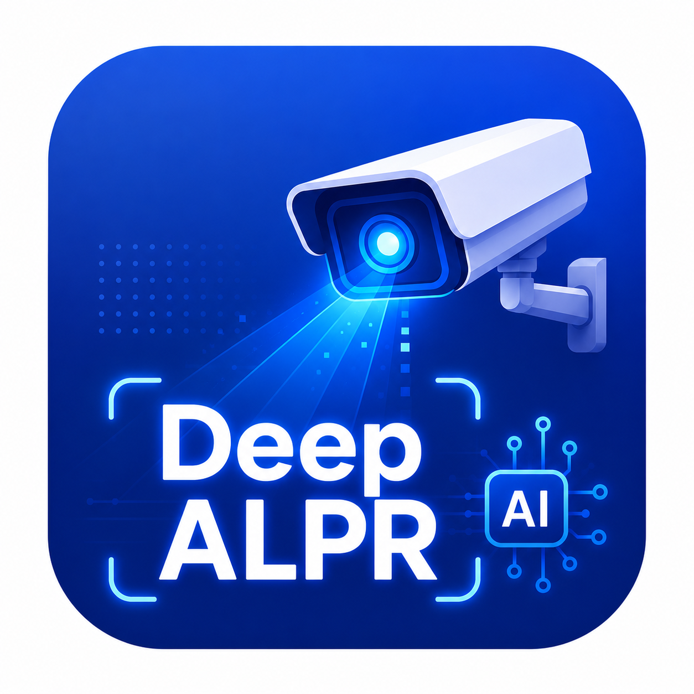
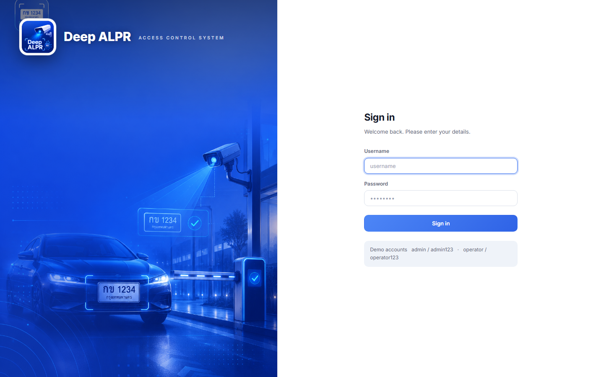
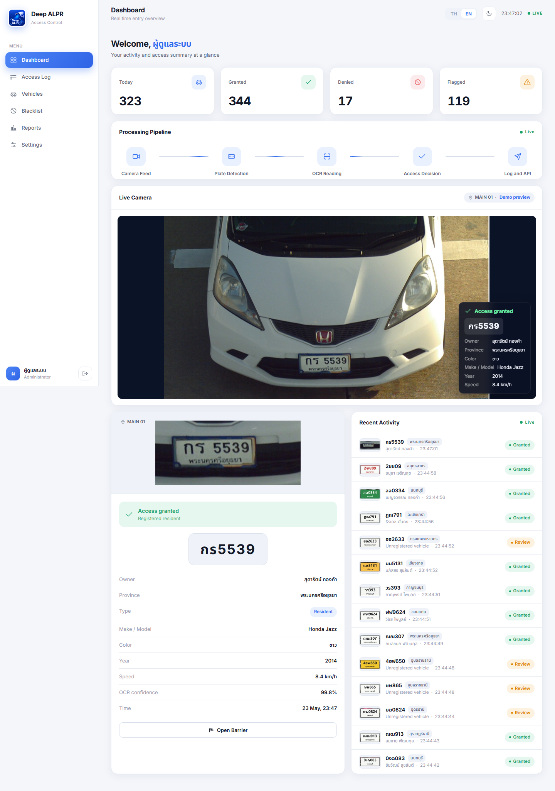
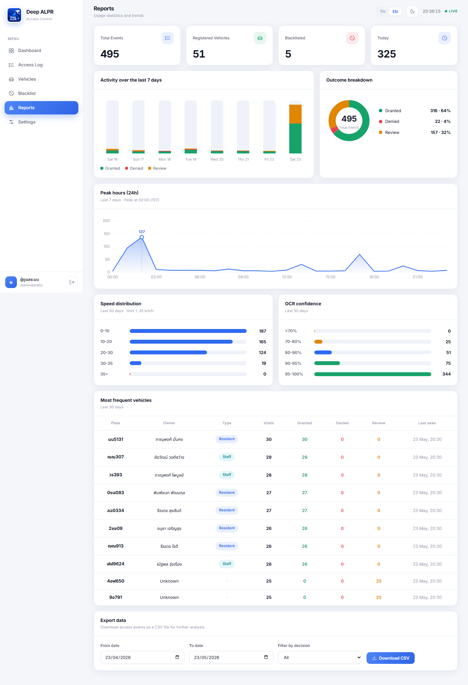
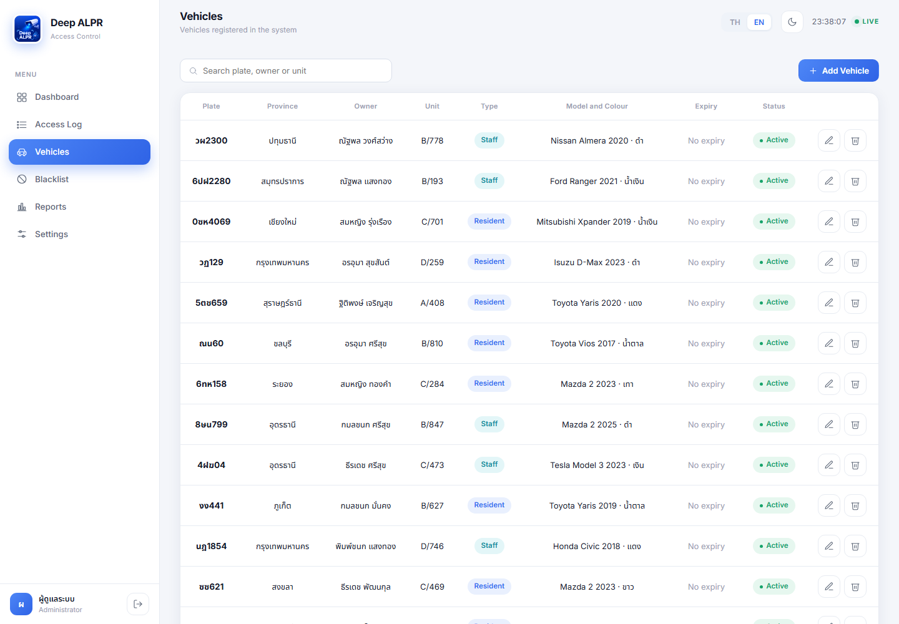
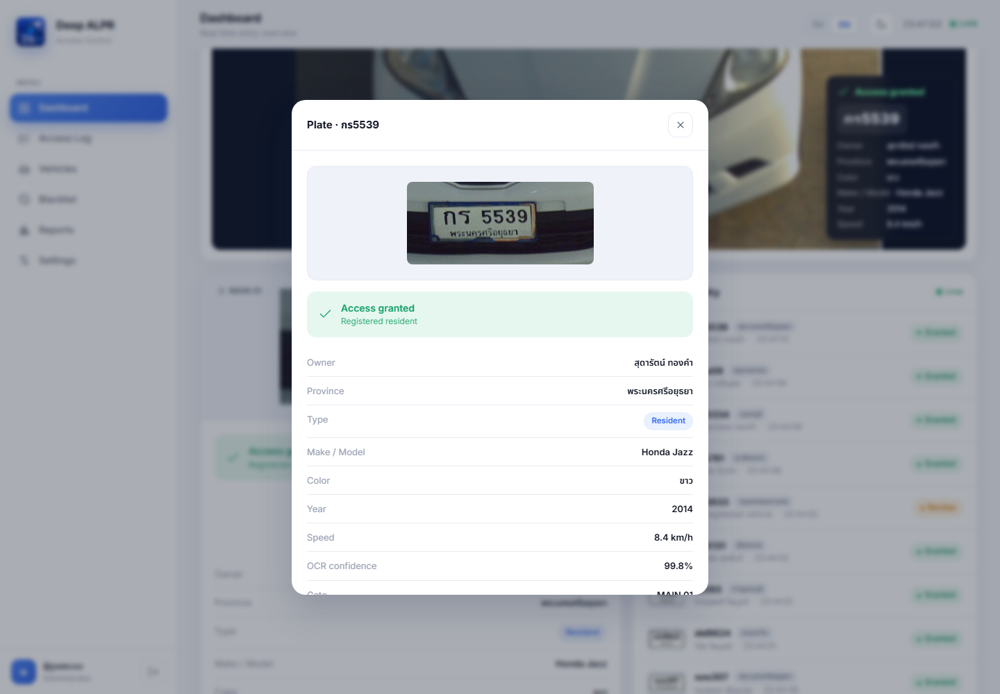

<div align="center">



# Deep ALPR

### Thai license-plate recognition for vehicle access control

Detects vehicles, reads Thai plates across all 8 plate categories, checks
against a whitelist + blacklist, and decides `granted` / `denied` / `alert`
in real time. Ships with a full operator dashboard, admin panel, REST API,
webhook integration, and a one-shot Windows installer.

<br>


<br>

**OCR accuracy 99.82%** &nbsp;·&nbsp; **CER 0.032%** &nbsp;·&nbsp; **mAP@50 99.5%** &nbsp;·&nbsp; **8 Thai plate types**

<br>



<sub><b>Sign-in screen</b> · split-pane layout · brand mark on the left · Inter + Noto Sans Thai · WCAG-AA contrast</sub>

</div>

---

## Showcase

<div align="center">

<table>
<tr>
<td width="50%">

<p align="center"><sub><b>Operator Console</b> · Live camera, real-time decisions, recent activity feed</sub></p>
</td>
<td width="50%">

<p align="center"><sub><b>Reports</b> · Peak hours, top vehicles, speed distribution, CSV export</sub></p>
</td>
</tr>
<tr>
<td width="50%">

<p align="center"><sub><b>Admin</b> · Vehicles, blacklist, users CRUD with province + year</sub></p>
</td>
<td width="50%">

<p align="center"><sub><b>Event popup</b> · Captured plate, decision, owner, color, model, year</sub></p>
</td>
</tr>
</table>

</div>

---

## ✨ Highlights

- 🇹🇭 **Thai-first OCR** — custom CRNN trained on **8 plate categories** (private, taxi, truck, motorcycle, government, EV, diplomatic, temporary)
- 🚗 **Two-stage detection** — YOLOv8 finds the vehicle, a fine-tuned YOLOv8 finds the plate
- 🗳️ **Multi-frame voting** — final reading is the consensus across every frame the plate was visible, not the first noisy read
- 🚦 **Speed-gated** — events above 35 km/h are flagged automatically
- 🎨 **HSV colour classifier** — 10 colours with no extra ML model, 85-95% accuracy in daylight
- 🛡️ **Whitelist + blacklist + status + expiry** decide `granted` / `denied` / `alert`
- 📊 **Reports + CSV export** — daily trends, peak hours, top vehicles, speed and OCR confidence distributions
- 🔌 **REST API + webhook** — every recognised plate is POSTed to any HTTP endpoint
- 🌗 **Polished dashboard** — vanilla JS SPA, light / dark theme, Thai + English at runtime, fully responsive
- ⚙️ **One-shot deployment** — `install.ps1` for Windows Service, or `docker compose up -d` for containers

---

## 🧱 Tech Stack

<table>
<tr>
<td valign="top" width="33%">

### Backend
<p>
<br>
<br>
<br>
<br>
<br>

</p>

</td>
<td valign="top" width="33%">

### AI / ML
<p>
<br>
<br>
<br>
<br>
<br>
<br>

</p>

</td>
<td valign="top" width="33%">

### Frontend
<p>
<br>
<br>
<br>
<br>
<br>

</p>

</td>
</tr>
<tr>
<td valign="top" width="33%">

### Deployment
<p>
<br>
<br>
<br>
<br>

</p>

</td>
<td valign="top" width="33%">

### Tooling
<p>
<br>
<br>
<br>

</p>

</td>
<td valign="top" width="33%">

### Data
<p>
<br>
<br>
<br>

</p>

</td>
</tr>
</table>

---

## 🏗️ Architecture

```
                   ┌──────────────────────────────────────┐
   IP Camera ─────▶│  YOLOv8 vehicle  →  YOLOv8 plate     │   Edge box
   (RTSP)         │      │                    │           │   (RTX 4060
                  │      ▼                    ▼           │    or Jetson)
                  │  Tracking (IoU + motion)              │
                  │      │                                │
                  │      ▼                                │
                  │  CRNN OCR  +  HSV colour              │
                  │      │                                │
                  │      ▼                                │
                  │  Multi-frame voting  →  Speed gate    │
                  │      │                                │
                  └──────┼────────────────────────────────┘
                         │
                         ▼
              ┌──────────────────────┐         ┌──────────────────┐
              │   Access controller  │ ──────▶ │ Gate hardware    │
              │   (whitelist /       │         │ (relay / Wiegand │
              │    blacklist / TTL)  │         │  / MQTT)         │
              └──────────┬───────────┘         └──────────────────┘
                         │
                         ▼
              ┌──────────────────────┐         ┌──────────────────┐
              │   SQLite + FastAPI   │ ──────▶ │ Operator console │
              │   + REST + webhook   │         │ + Admin panel    │
              └──────────────────────┘         └──────────────────┘
```

---

## 🚀 Quick Start

```powershell
# 1. clone + install (PyTorch with CUDA build for NVIDIA GPUs)
git clone https://github.com/Thanarat-Int/DeepALPR.git
cd DeepALPR
python -m venv venv
.\venv\Scripts\activate
pip install torch torchvision --index-url https://download.pytorch.org/whl/cu124
pip install -r requirements.txt

# 2. seed demo data (users, vehicles, blacklist, 170 access events)
python src/data/seed.py

# 3. run
python run_service.py
```

Open <http://127.0.0.1:8000>

| User | Password | Role |
| --- | --- | --- |
| `admin` | `admin123` | Administrator |
| `operator` | `operator123` | Operator |

---

## 🧠 Training

```powershell
# Generate 60,000 synthetic Thai plates across 8 categories
python src/data/make_dataset.py

# Train CRNN OCR (~25 min on RTX 4060, ~3 hr on CPU)
python src/training/train_ocr.py

# Train YOLOv8 plate detector (mock video + optional external data)
python src/training/train_plate_detector_combined.py

# Evaluate per-plate-type accuracy
python src/eval/evaluate_per_type.py
```

External datasets when an API key is provided:

```powershell
python src/data/fetch_external_dataset.py roboflow `
    --api-key YOUR_KEY --workspace WS --project PRJ --version 1
```

---

## 📁 Project Structure

```
src/alpr/        ALPR pipeline: detection, OCR, tracking, color, access, API
src/data/        Synthetic data generator, mock video composer, seed
src/training/    CRNN + YOLOv8 training scripts
src/eval/        Per-type evaluation and v1-vs-v2 comparison
dashboard/       Vanilla JS SPA (HTML / CSS / JS / images)
docs/            Production checklist, deployment guides, AI roadmap
models/          Trained model weights (.pt)
config.yaml      System configuration
run_service.py   Service entry point
install.ps1      Native Windows installer
Dockerfile       Container image
```

---

## 📦 Deployment

| Mode | Best for | Setup time |
| --- | --- | --- |
| **Native Windows Service (NSSM)** | Single PC at customer site | ~20 min via `install.ps1` |
| **Docker Compose** | Linux servers, multi-site, container shops | ~30 min |
| **Offline Deployment Kit** | Customer sites with no internet | USB drop-in |

Full guides in [`docs/`](docs/):

- [`deployment_guide_th.md`](docs/deployment_guide_th.md) — native installer walkthrough
- [`deployment_docker_th.md`](docs/deployment_docker_th.md) — Docker setup with GPU passthrough
- [`production_checklist_th.txt`](docs/production_checklist_th.txt) — 10 items required before go-live
- [`roadmap_senior_ai_engineer.md`](docs/roadmap_senior_ai_engineer.md) — bonus learning roadmap

---

## 📈 Benchmarks

<div align="center">

| Stage | Metric | Result |
| --- | --- | --- |
| OCR (CRNN) | exact-match across 8 plate types | **99.82%** |
| OCR (CRNN) | character error rate | **0.032%** |
| Plate detector (YOLOv8n) | mAP@50 | **0.995** |
| Plate detector (YOLOv8n) | mAP@50-95 | **0.991** |
| Plate detector | inference latency | **~2 ms** on RTX 4060 |
| Pipeline end-to-end | from frame to decision | **<400 ms** |

</div>

> Benchmarks measured on a synthetic test set of 5,000 plates covering all
> eight categories. Real-world accuracy requires re-training on site
> imagery; see the production checklist.

---

## 📜 License

Project code: **MIT**.

Ultralytics YOLOv8 weights inherit AGPL-3.0; obtain a commercial license
from Ultralytics if you ship this product to a paying customer.

---

<div align="center">

### Designed & built by **Thanarat.Chue**

<br>

<a href="https://github.com/Thanarat-Int">
  
</a>

<sub>If this project helped you, leave a ⭐ on the repo.</sub>

</div>
